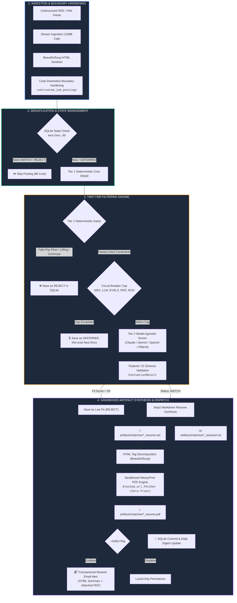

<div align="center">

```text
 ____                                      _     ___ 
| __ )  ___   __ _   ___  ___   _ __      / \   |_ _|
|  _ \ / _ \ / _` | / __|/ _ \ | '_ \    / _ \   | | 
| |_) |  __/| (_| || (__| (_) || | | |  / ___ \  | | 
|____/ \___| \__,_| \___|\___/ |_| |_| /_/   \_\|___|
```

### **Deterministic, Model-Agnostic Job Intelligence & Automated Application Engine**

*Bypass algorithmic hiring noise. Eliminate search fatigue. Automate targeted application synthesis with zero token waste.*

---

[](https://www.python.org/)
[](LICENSE)
[](https://docs.pydantic.dev/)
[-6366F1?style=for-the-badge&logo=openai&logoColor=white)](https://docs.litellm.ai/)
[](https://weasyprint.org/)
[](tests/)
[](.github/workflows/daily_scan.yml)

[Executive Overview](#-executive-overview) • [System Architecture](#-system-architecture) • [Security & Cost Shield](#-security--cost-shield) • [Model Agnostic Layer](#-zero-vendor-lock-in-model-matrix) • [Quick Start](#-quick-start) • [CLI Reference](#-cli-reference) • [CI/CD Runner](#-headless-github-actions-automation)

---

</div>

## 📌 Executive Overview

**BeaconAI** is an autonomous, model-agnostic CLI pipeline engineered to invert the commercial hiring board paradigm. Instead of trapping applicants in 20-hour weekly manual sifting loops across algorithmic aggregators and ghost postings, BeaconAI ingests unstructured RSS/XML feeds, applies **zero-cost deterministic constraint gates** (Tier 1), scores cleared candidates with **strictly typed Pydantic LLM schemas across any foundation provider** (Tier 2 via LiteLLM), and compiles bespoke, ATS-compliant PDF resumes alongside transactional email notifications and local digests.

```
       UNSTRUCTURED FEEDS               DETERMINISTIC GATES               GENERATED ARTIFACTS
 ┌─────────────────────────────┐    ┌─────────────────────────┐    ┌───────────────────────────────┐
 │ • Craigslist RSS            │    │ [Tier 1] Cost Shield    │    │ 📄 Sandboxed ATS PDF Resume   │
 │ • Municipal & County Boards │ ──>│ [Tier 2] Multi-LLM Scorer│ ──>│ ✉️  Resend Email Alert + Mailto│
 │ • Public Sector Feeds       │    │ SQLite Deduplication    │    │ 📊 Local Daily Markdown Digest│
 └─────────────────────────────┘    └─────────────────────────┘    └───────────────────────────────┘
```

### Why This Exists: The Problem Space

Between 2024 and 2026, the tech and administrative job markets reached peak algorithmic friction:
* **The Ghost Requisition Flood:** Up to 30%+ of syndicated job board entries are ghost requisitions, inflating vanity candidate pipelines with zero hiring intent.
* **The "Generalist Trap":** Commercial job boards optimize for platform stickiness and generic keyword indexing while ignoring non-negotiable boundaries like localized commutes, strict compensation floors, predictable shift boundaries, and physical restrictions.
* **Denial of Wallet & Context Drift:** Interactive chatbots require manual prompting, suffer from context drift across long sessions, and rack up expensive API bills re-evaluating unqualified roles.

**BeaconAI** resolves this through **systems thinking over toy AI prompting**: zero LLM tokens are consumed until deterministic logic certifies that a posting meets every compensation, physical, and geographic boundary.

---

## 🏗 System Architecture

BeaconAI operates as an end-to-end deterministic data pipeline with strict boundary hardening and sandboxed artifact compilation:



---

## 🛡 Security & Cost Shield

Every external input is treated as untrusted. BeaconAI enforces multi-layered defense-in-depth across deterministic parsers, LLM boundaries, PDF layout rendering, and outbound mail transport:

| Security Vector | Implementation Mechanism | Defensive Guarantee |
| :--- | :--- | :--- |
| **Tier 1 Cost Shield** | Deterministic Regex & String Parsing | Automatically rejects unqualified postings ($0 API spend) **before** calling foundation models. |
| **Zero-Trust PDF Sandbox** | Custom `blocked_url_fetcher` in WeasyPrint | Unconditionally raises `PermissionError` on all network (`http://`, `https://`, `169.254.169.254`), filesystem (`file://`), and base64 (`data:`) URIs, neutralizing SSRF and LFI attacks. |
| **Prompt Injection Isolation** | Regex Delimiter Neutralization | Escapes closing `</untrusted_job_posting>` tags with whitespace/case variants to prevent context breakout in LLM prompts. |
| **HTML Tag Decomposition** | BeautifulSoup Pre-Processing | Decomposes `<script>`, `<style>`, `<iframe>`, `<object>`, `<embed>`, and `<form>` elements in markdown prior to PDF layout compilation. |
| **Email Transport Hardening** | CRLF Stripping & URI Protocol Whitelist | Strips `[\r\n\t]+` from email subjects to prevent header splitting; forces `http://`/`https://` on links, replacing dangerous schemes (`javascript:`) with `"#"`. |
| **Circuit Breaker** | `MAX_LLM_EVALS_PER_RUN=20` | Prevents Denial of Wallet (DoW) attacks from malicious or oversized RSS floods. Throttled roles are tagged `DEFERRED` for future scans. |
| **State Poisoning Guard** | Isolated Artifact Synthesis | Defers SQLite `MATCH` commits until all artifacts generate successfully. Failed compilations do not burn candidate records. |
| **Persistence Safety** | SQLite Parameterized Queries | 100% parameterized queries (`?`) with composite indexing on `(url, status)` to prevent SQL injection and guarantee fast deduplication. |

---

## 🔌 Zero Vendor Lock-In: Model Matrix

BeaconAI leverages **LiteLLM** and **Instructor** to normalize structured outputs into strict Pydantic V2 models. Switch between foundation model providers or private local engines via a single `.env` setting with zero code refactoring:

| Provider | Engine Identifier Example | Ideal Use Case | Operational Profile |
| :--- | :--- | :--- | :--- |
| **Anthropic** | `claude-3-5-sonnet-20241022` | Complex technical roles & deep resume tailoring | State-of-the-art qualitative synthesis |
| **Google** | `gemini/gemini-2.5-flash` | High-speed batch scoring & rapid extraction | Low latency, cost-effective high-throughput |
| **OpenAI** | `gpt-4o`, `gpt-4o-mini` | Industry standard structured JSON extraction | High availability & standard enterprise SLA |
| **Local / Offline** | `ollama/llama3.2`, `ollama/mistral` | Air-gapped, zero-cost, 100% private local execution | Complete data privacy with zero token cost |

---

## 📋 Declarative Profile Configuration

BeaconAI decouples user constraints and professional history from execution logic. Candidate preferences are version-controlled in `profiles/your_profile.json`:

```bash
cp profiles/bookkeeper.json.example profiles/bookkeeper.json
```

```json
{
  "name": "Daniel Giovinazzo",
  "email": "contact@ddgiovinazzo.com",
  "phone": "555-019-2834",
  "location": "New York, NY",
  "linkedin_url": "https://linkedin.com/in/ddgiovinazzo",
  "constraints": {
    "min_hourly_rate": 20.0,
    "min_annual_salary": 45000.0,
    "max_commute_miles": 15,
    "physical_restrictions": [
      "heavy lifting > 25 lbs",
      "warehouse labor",
      "climb ladder"
    ],
    "schedule_boundaries": [
      "unannounced overtime",
      "graveyard shift"
    ]
  },
  "master_experience": {
    "target_titles": [
      "Software Engineer",
      "Systems Engineer",
      "Full Stack Developer"
    ],
    "roles": [
      {
        "title": "Software Engineer (K-12 Systems)",
        "organization": "PowerSchool",
        "location": "Remote / Folsom, CA",
        "start_date": "Jan 2021",
        "end_date": "Present",
        "bullets": [
          "Maintained modular data ingestion workflows for K-12 systems, protecting database integrity.",
          "Serialized legacy client web views into modern JSON payloads for 1,000,000 active users."
        ]
      }
    ],
    "tools_and_technologies": [
      "Python",
      "FastAPI",
      "SQLite",
      "Docker",
      "Git"
    ],
    "education": [
      "B.S. in Computer Science"
    ]
  }
}
```

---

## 🚀 Quick Start

### 1. Installation

```bash
# Clone the repository
git clone https://github.com/ddgiovinazzo/beacon-ai.git
cd beacon-ai

# Automated setup: creates virtualenv, installs dependencies, and initializes SQLite
make init
```

*Manual alternative:*
```bash
python3 -m venv .venv
source .venv/bin/activate
pip install -r requirements.txt
python main.py init-db
```

### 2. Configure Environment (`.env`)

```bash
cp .env.example .env
```

```ini
# Multi-Provider Model Selection (LiteLLM format)
LLM_MODEL=gemini/gemini-2.5-flash

# API Credentials (Set corresponding to your chosen LLM_MODEL)
GEMINI_API_KEY=your_gemini_api_key_here
# ANTHROPIC_API_KEY=your_claude_api_key_here
# OPENAI_API_KEY=your_openai_api_key_here
# OLLAMA_API_BASE=http://localhost:11434

# Transactional Email Alerts (Resend)
# RESEND_API_KEY=re_123456789
# NOTIFICATION_EMAIL_TO=contact@ddgiovinazzo.com
NOTIFICATION_EMAIL_FROM=BeaconAI <alerts@ddgiovinazzo.com>

# Database & Circuit Breaker Limits
DB_PATH=matches.db
MAX_LLM_EVALS_PER_RUN=20

# Polite Web Crawler Identity
USER_AGENT=BeaconAI/1.0 (+https://github.com/beacon-ai; polite-job-crawler)
REQUEST_TIMEOUT_SECONDS=15
```

---

## 💻 CLI Reference

### 1. Run Live Scan with Notifications
Ingests the target feed, filters candidates, evaluates matches with your LLM, compiles ATS PDFs, and dispatches transactional emails:
```bash
python main.py scan --profile profiles/bookkeeper.json.example --feed "https://hudsonvalley.craigslist.org/search/acc?format=rss" --notify
```

### 2. Local Dry-Run (Zero Token Cost)
Tests ingestion, SQLite deduplication, Tier 1 gates, and sandboxed PDF compilation against test fixtures without calling external APIs:
```bash
python main.py scan --profile profiles/bookkeeper.json.example --feed tests/fixtures/sample_jobs.xml --dry-run
```

### 3. Interactive Gate Testing (`test-eval`)
Instantly tests Tier 1 deterministic rules and compensation extractors against arbitrary text:
```bash
python main.py test-eval --text "Bookkeeper needed. \$25 - 30/hr. Full-time seated office role." --profile profiles/bookkeeper.json.example
```

### 4. Database Metrics & Rejection Analytics (`stats`)
Displays persistent crawl metrics, match averages, and detailed categorical rejection breakdowns:
```bash
python main.py stats
```

---

## ⚙️ Headless GitHub Actions Automation

BeaconAI operates as an autonomous background agent via a scheduled GitHub Actions workflow ([`.github/workflows/daily_scan.yml`](.github/workflows/daily_scan.yml)):

* **Cron Schedule:** Executes daily at `0 12 * * *` (8:00 AM EST) with support for on-demand `workflow_dispatch` manual triggers.
* **Concurrency Lock:** Enforces `concurrency: daily-scan-execution` to prevent overlapping runs and eliminate race conditions on binary SQLite databases.
* **Automated State Persistence:** Automatically stages, commits, and pushes updated `matches.db` tracking and daily Markdown digests back to GitHub with `[skip ci]`.
* **Zero Binary Bloat:** Binary PDF resumes are compiled in a local sandbox and excluded from git history via `.gitignore` rules (`artifacts/matches/*.pdf`), keeping the repository lightweight.

---

## 🧪 Automated QA Test Suite

BeaconAI includes **40 automated test fixtures** validating deterministic regex parsers, prompt injection defenses, circuit-breaker states, model-agnostic routing, sandboxed PDF rendering, and transactional email security:

```bash
# Run full automated test suite
pytest -v
```

```text
============================= test session starts ==============================
platform darwin -- Python 3.14.7, pytest-9.1.1, pluggy-1.6.0
rootdir: /Users/daniel/code/beacon-ai
configfile: pyproject.toml
testpaths: tests
plugins: anyio-4.15.1
collected 40 items

tests/test_evaluator.py::test_extract_compensation_hourly PASSED         [  2%]
tests/test_evaluator.py::test_extract_compensation_annual PASSED         [  5%]
tests/test_evaluator.py::test_tier1_rejects_lifting_violation PASSED     [  7%]
tests/test_evaluator.py::test_tier1_rejects_keyword_physical_restriction PASSED [ 10%]
tests/test_evaluator.py::test_tier1_rejects_hourly_pay_floor_violation PASSED [ 12%]
tests/test_evaluator.py::test_tier1_rejects_schedule_conflict PASSED     [ 15%]
tests/test_evaluator.py::test_tier1_passes_qualified_job PASSED          [ 17%]
tests/test_evaluator.py::test_tier2_heuristic_matches_aligned_role PASSED [ 20%]
tests/test_evaluator.py::test_circuit_breaker_caps_evaluations PASSED    [ 22%]
tests/test_evaluator.py::test_extract_compensation_single_dollar_range PASSED [ 25%]
tests/test_evaluator.py::test_extract_compensation_salary_shorthand_and_ranges PASSED [ 27%]
tests/test_evaluator.py::test_idiomatic_ladder_not_rejected PASSED       [ 30%]
tests/test_evaluator.py::test_physical_ladder_rejected PASSED            [ 32%]
tests/test_evaluator.py::test_circuit_breaker_sets_deferred_and_eligible_for_rescan PASSED [ 35%]
tests/test_evaluator.py::test_has_llm_credentials_multi_provider PASSED  [ 37%]
tests/test_evaluator.py::test_evaluate_tier2_llm_model_agnostic_routing PASSED [ 40%]
tests/test_evaluator.py::test_generate_tailored_resume_data_model_agnostic PASSED [ 42%]
tests/test_generator.py::test_blocked_url_fetcher_prevents_ssrf_and_lfi PASSED [ 45%]
tests/test_generator.py::test_export_markdown_to_pdf_generates_valid_pdf PASSED [ 47%]
tests/test_generator.py::test_export_markdown_to_pdf_blocks_remote_image_ssrf PASSED [ 50%]
tests/test_generator.py::test_export_markdown_to_pdf_blocks_local_file_lfi PASSED [ 52%]
tests/test_generator.py::test_export_markdown_to_pdf_decomposes_inline_dangerous_tags PASSED [ 55%]
tests/test_generator.py::test_scan_fault_tolerance_on_artifact_error PASSED [ 57%]
tests/test_ingestion.py::test_sanitize_html_strips_scripts_and_styles PASSED [ 60%]
tests/test_ingestion.py::test_sanitize_html_strips_hidden_elements PASSED [ 62%]
tests/test_ingestion.py::test_sanitize_html_removes_zero_width_chars PASSED [ 65%]
tests/test_ingestion.py::test_wrap_untrusted_content_boundaries PASSED   [ 67%]
tests/test_ingestion.py::test_fetch_feed_parses_sample_xml PASSED        [ 70%]
tests/test_ingestion.py::test_wrap_untrusted_content_case_and_whitespace_variants PASSED [ 72%]
tests/test_ingestion.py::test_slug_uniqueness_for_identical_titles PASSED [ 75%]
tests/test_ingestion.py::test_fetch_feed_enforces_byte_limit PASSED      [ 77%]
tests/test_notifier.py::test_extract_mailto_from_outreach PASSED         [ 80%]
tests/test_notifier.py::test_extract_mailto_nonexistent_file PASSED      [ 82%]
tests/test_notifier.py::test_build_notification_html PASSED              [ 85%]
tests/test_notifier.py::test_send_match_notification_missing_credentials PASSED [ 87%]
tests/test_notifier.py::test_send_match_notification_success PASSED      [ 90%]
tests/test_notifier.py::test_send_match_notification_api_error_handling PASSED [ 92%]
tests/test_notifier.py::test_send_match_notification_sanitizes_crlf_subject PASSED [ 95%]
tests/test_notifier.py::test_build_notification_html_sanitizes_dangerous_schemes PASSED [ 97%]
tests/test_notifier.py::test_settings_validates_email_format PASSED      [100%]

======================= 40 passed, 10 warnings in 1.99s ========================
```

---

## 📄 License

Distributed under the **MIT License**. See [`LICENSE`](LICENSE) for complete terms.