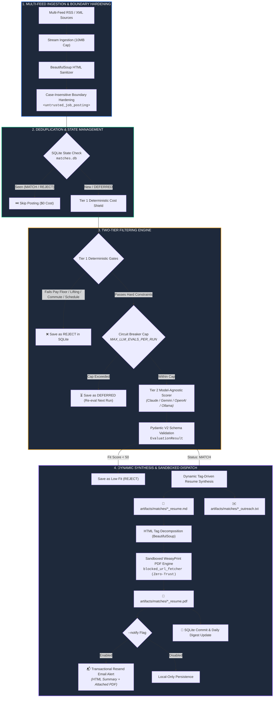

<div align="center">

```text
 ____                                      _     ___ 
| __ )  ___   __ _   ___  ___   _ __      / \   |_ _|
|  _ \ / _ \ / _` | / __|/ _ \ | '_ \    / _ \   | | 
| |_) |  __/| (_| || (__| (_) || | | |  / ___ \  | | 
|____/ \___| \__,_| \___|\___/ |_| |_| /_/   \_\|___|
```

### **Deterministic, Model-Agnostic Job Intelligence & Automated Application Engine**

*Bypass algorithmic hiring noise. Eliminate search fatigue. Automate targeted application synthesis with zero token waste.*

---

[](https://www.python.org/)
[](LICENSE)
[](https://docs.pydantic.dev/)
[-6366F1?style=for-the-badge&logo=openai&logoColor=white)](https://docs.litellm.ai/)
[](https://weasyprint.org/)
[](.github/workflows/daily_scan.yml)

[Executive Overview](#-executive-overview) • [System Architecture](#-system-architecture) • [The Selector Pattern](#-the-multi-track-persona-engine-the-selector-pattern) • [Security & Cost Shield](#-security--cost-shield) • [Model Agnostic Layer](#-zero-vendor-lock-in-model-matrix) • [Declarative Profile Configuration](#-declarative-profile-configuration) • [Quick Start](#-quick-start) • [CLI Reference](#-cli-reference) • [CI/CD Runner](#-zero-storage-github-actions-automation) • [Author & Contact](#-author--contact)

---

</div>

## 📌 Executive Overview

**BeaconAI v2.4** is an autonomous, model-agnostic CLI pipeline engineered to invert the commercial hiring board paradigm. Instead of trapping applicants in 20-hour weekly manual sifting loops across algorithmic aggregators and ghost postings, BeaconAI ingests unstructured RSS/XML feeds and **native IMAP email alerts** (e.g., Craigslist saved search alerts, Indeed, LinkedIn), applies **zero-cost deterministic constraint gates** (Tier 1), scores cleared candidates with **strictly typed Pydantic LLM schemas across any foundation provider** (Tier 2 via LiteLLM), and compiles bespoke, ATS-compliant PDF resumes alongside transactional email alerts and local digests.

```
       UNSTRUCTURED INGESTION            DETERMINISTIC GATES               GENERATED ARTIFACTS
 ┌─────────────────────────────┐    ┌─────────────────────────┐    ┌───────────────────────────────┐
 │ • Multi-Source RSS/XML Feeds│    │ [Tier 1] Cost Shield    │    │ 📄 Sandboxed ATS PDF Resume   │
 │ • IMAP Email Alerts         │ ──>│ [Tier 2] Multi-LLM Scorer│ ──>│ ✉️  Resend Email Alert + Mailto│
 │   (Craigslist, Indeed, etc.)│    │ SQLite Deduplication    │    │ 📊 Local Daily Markdown Digest│
 └─────────────────────────────┘    └─────────────────────────┘    └───────────────────────────────┘
```

### Why This Exists: The Problem Space

Between 2024 and 2026, the job market reached peak algorithmic friction:
* **The Ghost Requisition Flood:** Up to 30%+ of syndicated job board entries are ghost requisitions, inflating vanity candidate pipelines with zero hiring intent.
* **The "Generalist Trap":** Commercial job boards optimize for platform stickiness and generic keyword indexing while ignoring non-negotiable boundaries like localized commutes, strict compensation floors, predictable shift boundaries, and physical restrictions.
* **Denial of Wallet & Context Drift:** Interactive chatbots require manual prompting, suffer from context drift across long sessions, and rack up expensive API bills re-evaluating unqualified roles.

**BeaconAI** resolves this through **systems thinking over toy AI prompting**: zero LLM tokens are consumed until deterministic logic certifies that a posting meets every compensation, physical, and geographic boundary.

---

## 🏗 System Architecture

BeaconAI operates as an end-to-end deterministic data pipeline with strict boundary hardening, dynamic tag-driven synthesis, and sandboxed artifact compilation:



---

## 🎯 The Multi-Track Persona Engine (The Selector Pattern)

### The Architectural Flaw in Generative AI Resumes

Most AI career automation tools treat resume tailoring as an unstructured, free-form generative prompt: they dump the applicant's complete life history into a massive prompt and ask the LLM to *"write a tailored resume for this job."* 

In production, this approach collapses due to three critical engineering failures:
1. **Context Poisoning:** If an applicant has a versatile background spanning software engineering, data systems, and operational back-office roles, a single prompt forces the model to synthesize strange, Frankensteinian hybrids. An Accounts Payable posting receives an applicant boasting about React microservices and Kubernetes deployments, triggering immediate ATS disqualification for overqualification and domain mismatch.
2. **Hallucinations on Small / Lite Models:** Cost-effective, high-throughput models (e.g. Gemini 2.5 Flash Lite) struggle with negative constraints when given generative freedom. Asked to write bullets and skills from scratch, they hallucinate tools the candidate never used or fabricate metrics that fail background verification.
3. **Layout Bleed & Page Budget Violations:** When the LLM decides how many sections or bullets to generate, the compiled document invariably spills over by 3 to 5 lines onto a second page—breaking the strict single-page physical layout standard expected by hiring managers.

```text
       TRADITIONAL TOY AI (Context Poisoning & Hallucination)
  ┌───────────────────────────────────────────────────────────┐
  │ Candidate's Entire Life History (Tech + Admin + Finance)  │
  └─────────────────────────────┬─────────────────────────────┘
                                │  (Unconstrained Generation)
                                ▼
  ┌───────────────────────────────────────────────────────────┐
  │ ❌ Hallucinated hybrid resume; React on Bookkeeping role;  │
  │    2-page spillover; Immediate recruiter rejection.       │
  └───────────────────────────────────────────────────────────┘

           BEACONAI SELECTOR PATTERN (Deterministic Isolation)
  ┌───────────────────────────────────────────────────────────┐
  │                   Incoming Job Posting                    │
  └─────────────────────────────┬─────────────────────────────┘
                                │
                                ▼
            [Deterministic resolve_profile_track Router]
        ┌───────────────────────┼───────────────────────┐
        ▼                       ▼                       ▼
 ┌───────────────┐       ┌───────────────┐       ┌───────────────┐
 │Track 1: Data  │       │Track 3: AP/AR │       │Track 6: Full  │
 │Entry/Clerical │       │& Bookkeeping  │       │Stack Software │
 ├───────────────┤       ├───────────────┤       ├───────────────┤
 │• Human Skills │       │• Human Skills │       │• Human Skills │
 │• Projects: [] │       │• Projects: [] │       │• Proj: Beacon │
 │• LinkedIn Only│       │• LinkedIn Only│       │• Portfolio+LI │
 └───────┬───────┘       └───────┬───────┘       └───────┬───────┘
         │                       │                       │
         └───────────────────────┼───────────────────────┘
                                 ▼
       ┌───────────────────────────────────────────────────┐
       │ 🛡️ STRICT ZERO-GENERATION COMPILER                │
       │ • 0% LLM-invented skills (Matrix is 100% frozen)  │
       │ • 1-Page Layout Guarantee (Projects auto-hidden)  │
       │ • 2-Sentence Anti-Fluff Trait/Outcome Formula     │
       └───────────────────────────────────────────────────┘
```

### The Solution: The Selector Pattern

BeaconAI eliminates context poisoning and hallucinations by replacing unconstrained generative prompts with **The Selector Pattern**:

* **Isolated Persona Pools (`ProfileTrack`):** Candidate experience is compartmentalized into discrete, self-contained tracks (`clerical_data_entry`, `office_administrative`, `accounting_bookkeeping`, `technical_support_qa`, `data_analysis_reporting`, `software_engineering`). Each track encapsulates its own target job titles, trigger keywords, tailored bullet pools, pre-categorized skills matrices, and section visibility flags.
* **Deterministic Track Router (`resolve_profile_track`):** Incoming job titles and descriptions are analyzed using token-overlap heuristics and trigger keyword matching. The router maps the posting to exactly one profile track *before* any prompt is synthesized. Postings outside candidate target domains are rejected immediately with zero token expenditure.
* **Zero Generative AI for Skills & Matrix:** The LLM is strictly prohibited from writing or inventing skills. Skills sections (`CORE COMPETENCIES & SKILLS`, `FINANCIAL & ACCOUNTING COMPETENCIES`, `TECHNICAL SKILLS`) are rendered directly from the track's human-curated skills matrix.
* **Single-Page Layout Guarantee:** Operational and non-technical tracks configure `projects: []`. The resume template uses Jinja2 conditional rendering (``) to suppress the `PROJECTS` section entirely, allowing the experience and competencies sections to breathe while snapping precisely to a clean 1-page PDF.
* **Anti-Fluff 2-Sentence Summary Formula:** The LLM or deterministic synthesizer must choose from a curated bank of approved professional traits (Sentence 1) and verifiable outcomes (Sentence 2). Subjective filler adjectives (*"methodical"*, *"hard-working"*, *"quiet efficiency"*) and cliché boilerplate endings (*"Prepared to make an immediate impact"*) are hard-rejected.
* **Context-Aware Link Scrubbing:** Raw GitHub repository URLs are dropped across all tracks. Technical portfolio links (`ddgiovinazzo.com`) appear exclusively on engineering and data tracks, while non-technical applications present a clean, credible header with LinkedIn and direct phone/email contact.
* **Predefined Title Selector (Anti-Hallucination Headlines):** Instead of allowing the LLM to invent resume headlines or echoing messy job board titles (*"Clerical / Administrative Assistant Needed Immediately - Great Benefits!"*), each track defines the 3 most standard professional titles for that domain. The headline and outreach subject are strictly selected from this 3-title bank, eliminating typos, weird slashes, and recruiter advertising noise.
* **Intelligent Recruitment Ad Title Cleaner:** Automated regex cleans verbose advertising phrasing common in job boards (e.g., `"Construction Company seeking Clerical/ Administrative Assistant"` -> `"Clerical / Administrative Assistant"`), ensuring generated resumes and outreach emails address the legitimate position title with professional polish.

---

## 🛡 Security & Cost Shield

Every external input is treated as untrusted. BeaconAI enforces multi-layered defense-in-depth across deterministic parsers, LLM boundaries, PDF layout rendering, and outbound mail transport:

| Security Vector | Implementation Mechanism | Defensive Guarantee |
| :--- | :--- | :--- |
| **Tier 1 Cost Shield** | Dynamic Regex & Constraint Verification | Automatically rejects unqualified postings ($0 API spend) **before** calling foundation models. |
| **Zero-Trust PDF Sandbox** | Custom `blocked_url_fetcher` in WeasyPrint | Unconditionally raises `PermissionError` on all network (`http://`, `https://`, `169.254.169.254`), filesystem (`file://`), and base64 (`data:`) URIs, neutralizing SSRF and LFI attacks. |
| **Zero-Storage Secrets** | Ephemeral Runner Ingestion | Candidate profile is injected via base64 GitHub Secrets at runtime and purged under `if: always()`, preventing private candidate PII from entering Git history. |
| **Prompt Injection Isolation** | Regex Delimiter Neutralization | Escapes closing `</untrusted_job_posting>` tags with whitespace/case variants to prevent context breakout in LLM prompts. |
| **HTML Tag Decomposition** | BeautifulSoup Pre-Processing | Decomposes `<script>`, `<style>`, `<iframe>`, `<object>`, `<embed>`, and `<form>` elements in markdown prior to PDF layout compilation. |
| **Email Transport Hardening** | CRLF Stripping & URI Protocol Whitelist | Strips `[\r\n\t]+` from email subjects to prevent header splitting; forces `http://`/`https://` on links, replacing dangerous schemes (`javascript:`) with `"#"`. |
| **Circuit Breaker** | `MAX_LLM_EVALS_PER_RUN=20` | Prevents Denial of Wallet (DoW) attacks from malicious or oversized RSS floods. Throttled roles are tagged `DEFERRED` for future scans. |
| **State Poisoning Guard** | Isolated Artifact Synthesis | Defers SQLite `MATCH` commits until all artifacts generate successfully. Failed compilations do not burn candidate records. |
| **Persistence Safety** | SQLite Parameterized Queries | 100% parameterized queries (`?`) with composite indexing on `(url, status)` to prevent SQL injection and guarantee fast deduplication. |

---

## 🔌 Zero Vendor Lock-In: Model Matrix

BeaconAI leverages **LiteLLM** and **Instructor** to normalize structured outputs into strict Pydantic V2 models. Switch between foundation model providers or private local engines dynamically via the `LLM_MODEL` environment variable (or `--model` CLI option) with a single unified `LLM_API_KEY` setting and zero code refactoring:

| Provider | Engine Identifier Example | Ideal Use Case | Operational Profile |
| :--- | :--- | :--- | :--- |
| **Google** | `gemini/gemini-2.5-flash-lite` | High-speed batch scoring & rapid extraction | Low latency, high RPM/throughput |
| **Anthropic** | `claude-3-5-sonnet-20241022` | Complex technical roles & deep resume tailoring | State-of-the-art qualitative synthesis |
| **OpenAI** | `gpt-4o`, `gpt-4o-mini` | Industry standard structured JSON extraction | High availability & standard enterprise SLA |
| **Local / Offline** | `ollama/llama3.2`, `ollama/mistral` | Air-gapped, zero-cost, 100% private local execution | Complete data privacy with zero token cost |

---

## 📋 Declarative Profile Configuration

BeaconAI is 100% context-agnostic: candidate constraints, master experience banks, and credentials are completely decoupled from operational infrastructure and configured in a declarative JSON profile.

```bash
cp profiles/bookkeeper.json.example profiles/my_profile.json
# or
cp profiles/software_engineer.json.example profiles/my_profile.json
```

### Generic Profile Schema Example

```json
{
  "name": "Jane Doe",
  "email": "jane.doe@example.com",
  "phone": "(555) 234-5678",
  "location": "Metropolis, NY",
  "linkedin_url": "https://linkedin.com/in/janedoe-pro",
  "portfolio_url": "https://janedoe.example.com",
  "github_url": "https://github.com/janedoe-dev",
  "constraints": {
    "min_hourly_rate": 28.0,
    "min_weekly_earnings": null,
    "min_annual_salary": 58000.0,
    "max_commute_miles": 20,
    "physical_restrictions": [
      "heavy lifting",
      "ladder climbing",
      "warehouse labor"
    ],
    "schedule_boundaries": [
      "overnight",
      "graveyard shift",
      "mandatory weekends",
      "unannounced overtime"
    ]
  },
  "master_experience": {
    "target_titles": [
      "Software Engineer",
      "Systems Analyst",
      "Backend Developer"
    ],
    "narrative_context": "Reliable systems engineer focused on high-throughput backend services and cloud automation.",
    "engineering_projects": [
      {
        "id": "proj-1",
        "name": "EventBridge Stream Engine",
        "tags": ["python", "backend", "cloud"],
        "bullets": [
          "Engineered high-throughput event processing pipelines ingesting 2.4M daily telemetry messages."
        ]
      }
    ],
    "roles": [
      {
        "id": "role-1",
        "title": "Software Engineer",
        "organization": "Acme Cloud Platforms",
        "location": "Metropolis, NY",
        "start_date": "Jan 2021",
        "end_date": "Present",
        "tags": ["backend", "python", "cloud", "api"],
        "bullets": [
          "Developed scalable REST microservices in FastAPI serving 150K monthly active users.",
          "Maintained CI/CD pipelines on GitHub Actions, cutting release cycles by 65%."
        ]
      }
    ],
    "tools_and_technologies": [
      "Python",
      "FastAPI",
      "PostgreSQL",
      "Docker",
      "Git"
    ],
    "education": [
      {
        "id": "edu-1",
        "institution": "Metropolis Technical Institute",
        "degree": "B.S. in Computer Science",
        "start_date": "2016",
        "end_date": "2020",
        "tags": ["tech", "universal"]
      }
    ],
    "certifications": [
      {
        "name": "AWS Certified Solutions Architect",
        "status": "Active"
      }
    ]
  }
}
```

### Dynamic Heuristics & Selection Rules
1. **Metadata Tag Matching (`role.tags`, `project.tags`):** Tailored resumes selectively extract roles and projects whose tags match the posting domain, preventing overqualification or domain mismatches.
2. **Geographic Education Heuristics (`education.tags`):** When applying to local/municipal postings, credentials tagged `"local"` are prioritized to demonstrate regional roots. For remote or distant technical postings, hyper-local institutions are omitted in favor of `"tech"` and `"universal"` credentials.
3. **Strategic Tone Calibration:** The candidate's `narrative_context` guides the LLM synthesizer to calibrate tone and avoid inflated seniority verbs.

---

## 🚀 Quick Start

### 1. Installation

```bash
# Clone the repository
git clone https://github.com/ddgiovinazzo/beacon-ai.git
cd beacon-ai

# Automated setup: creates virtualenv, installs dependencies, and initializes SQLite
make init
```

*Manual alternative:*
```bash
python3 -m venv .venv
source .venv/bin/activate
pip install -r requirements.txt
python main.py init-db
```

### 2. Configure Environment (`.env`)

```bash
cp .env.example .env
```

```ini
# Unified LLM API Key (works across all LiteLLM foundation models)
LLM_API_KEY=your_llm_api_key_here

# Transactional Email Alerts (Resend)
# RESEND_API_KEY=re_123456789
# NOTIFICATION_EMAIL_TO=your_email@example.com
NOTIFICATION_EMAIL_FROM=BeaconAI <alerts@example.com>

# Target Feed URLs (Fallback when not specified on CLI)
# TARGET_FEED_URLS=https://example.com/rss1\nhttps://example.com/rss2

# IMAP Email Ingestion (Craigslist, Indeed, LinkedIn job alerts)
# IMAP_SERVER=imap.gmail.com
# IMAP_PORT=993
# IMAP_USERNAME=your_email@gmail.com
# IMAP_PASSWORD=your_app_specific_password
# IMAP_MAILBOX=INBOX
# IMAP_SEARCH_CRITERIA=UNSEEN
# IMAP_MARK_SEEN=true

# Database & Circuit Breaker Limits
DB_PATH=matches.db
MAX_LLM_EVALS_PER_RUN=20

# Polite Web Crawler Identity
USER_AGENT=BeaconAI/1.0 (+https://github.com/beacon-ai; polite-job-crawler)
REQUEST_TIMEOUT_SECONDS=15
```

---

## 💻 CLI Reference

### 1. Run Live Multi-Feed & Email Alert Scan with Notifications
Ingests multiple RSS feeds and/or unread IMAP job alert emails (Craigslist saved searches, Indeed, LinkedIn), filters candidates, evaluates matches with your LLM, compiles ATS PDFs, and dispatches transactional emails:
```bash
python main.py scan \
  --profile profiles/my_profile.json \
  --feed "https://example.com/feed1.rss" \
  --feed "https://example.com/feed2.rss" \
  --check-email \
  --notify
```

> [!TIP]
> **Craigslist & Job Board Saved Search Alerts**: Directly scraping Craigslist in cloud environments often triggers anti-bot blocks. Instead, save your desired search query on Craigslist (or Indeed/LinkedIn) with **Email Alerts enabled**. BeaconAI securely connects to your IMAP mailbox over SSL, parses multi-job HTML alert emails, extracts clean job postings into `<untrusted_job_posting>` boundaries, and marks them `\Seen` without deleting them.

### 2. Local Dry-Run (Zero Token Cost)
Tests ingestion, SQLite deduplication, Tier 1 gates, and sandboxed PDF compilation against test fixtures without calling external APIs:
```bash
python main.py scan --profile profiles/bookkeeper.json.example --feed tests/fixtures/sample_jobs.xml --dry-run
```

### 3. Interactive Gate Testing (`test-eval`)
Instantly tests Tier 1 deterministic rules, compensation extractors, and commute checks against arbitrary text:
```bash
python main.py test-eval --text "Bookkeeper needed. $25 - 30/hr. Full-time seated office role." --profile profiles/bookkeeper.json.example
```

### 4. Database Metrics & Rejection Analytics (`stats`)
Displays persistent crawl metrics, match averages, and detailed categorical rejection breakdowns:
```bash
python main.py stats
```

---

## ⚙️ Zero-Storage GitHub Actions Automation

BeaconAI operates as an autonomous background agent via a scheduled, headless GitHub Actions workflow ([`.github/workflows/daily_scan.yml`](.github/workflows/daily_scan.yml)):

* **Zero-Storage Privacy:** Ingests the candidate profile dynamically from the `USER_PROFILE_JSON_B64` secret at runtime. Decodes to `profiles/ephemeral_profile.json` and purges it under `if: always()` so no candidate data remains on the runner or in Git history.
* **Dynamic Multi-Feed Ingestion:** Loops across feeds defined in repository variable `TARGET_FEED_URLS` (or secret `TARGET_FEED_URLS`), allowing feed sources to be managed without committing code.
* **IMAP Mailbox Integration:** Supports `IMAP_SERVER`, `IMAP_USERNAME`, and `IMAP_PASSWORD` secrets to automatically check for job alerts during scheduled runs.
* **Cron Schedule:** Executes daily at `0 12 * * *` (8:00 AM EST) with support for on-demand `workflow_dispatch` manual triggers.
* **Concurrency Lock:** Enforces `concurrency: daily-scan-execution` to prevent overlapping runs and eliminate race conditions on binary SQLite databases.
* **Automated State Persistence:** Automatically stages, commits, and pushes updated `matches.db` tracking and daily Markdown digests back to GitHub with `[skip ci]`.
* **Zero Binary Bloat:** Resumes and drafts are maintained under ephemeral zero-storage policies (`artifacts/matches/` in `.gitignore`), keeping candidate PII completely off GitHub.

---

## 🧪 Automated QA Test Suite

BeaconAI includes **80 automated test fixtures** validating deterministic regex parsers, prompt injection defenses, circuit-breaker states, model-agnostic routing, sandboxed ATS vector PDF rendering, recruiter-friendly filenaming, dynamic role selection, markdown bullet/sane list parsing, transactional email security, and RFC 2047 / IMAP email alert parsing:

```bash
# Run full automated test suite
pytest -v
```

```text
============================= test session starts ==============================
platform darwin -- Python 3.14.7, pytest-9.1.1, pluggy-1.6.0
rootdir: /path/to/beacon-ai
configfile: pyproject.toml
testpaths: tests
plugins: anyio-4.15.1
collected 61 items

tests/test_evaluator.py::test_extract_compensation_hourly PASSED         [  1%]
tests/test_evaluator.py::test_extract_compensation_annual PASSED         [  3%]
tests/test_evaluator.py::test_tier1_rejects_lifting_violation PASSED     [  4%]
tests/test_evaluator.py::test_tier1_rejects_keyword_physical_restriction PASSED [  6%]
tests/test_evaluator.py::test_tier1_rejects_hourly_pay_floor_violation PASSED [  8%]
tests/test_evaluator.py::test_tier1_rejects_schedule_conflict PASSED     [  9%]
tests/test_evaluator.py::test_tier1_passes_qualified_job PASSED          [ 11%]
tests/test_evaluator.py::test_tier2_heuristic_matches_aligned_role PASSED [ 13%]
tests/test_evaluator.py::test_circuit_breaker_caps_evaluations PASSED    [ 14%]
tests/test_evaluator.py::test_extract_compensation_single_dollar_range PASSED [ 16%]
tests/test_evaluator.py::test_extract_compensation_salary_shorthand_and_ranges PASSED [ 18%]
tests/test_evaluator.py::test_idiomatic_ladder_not_rejected PASSED       [ 19%]
tests/test_evaluator.py::test_physical_ladder_rejected PASSED            [ 21%]
tests/test_evaluator.py::test_circuit_breaker_sets_deferred_and_eligible_for_rescan PASSED [ 22%]
tests/test_evaluator.py::test_has_llm_credentials_multi_provider PASSED  [ 24%]
tests/test_evaluator.py::test_evaluate_tier2_llm_model_agnostic_routing PASSED [ 26%]
tests/test_evaluator.py::test_generate_tailored_resume_data_model_agnostic PASSED [ 27%]
tests/test_evaluator.py::test_tier1_rejects_dynamic_physical_restriction PASSED [ 29%]
tests/test_evaluator.py::test_tier1_rejects_commute_distance_exceeding_max PASSED [ 31%]
tests/test_evaluator.py::test_tier1_allows_remote_job_regardless_of_distance PASSED [ 32%]
tests/test_evaluator.py::test_tier2_heuristic_scores_dynamic_tags PASSED [ 34%]
tests/test_generator.py::test_blocked_url_fetcher_prevents_ssrf_and_lfi PASSED [ 36%]
tests/test_generator.py::test_export_markdown_to_pdf_generates_valid_pdf PASSED [ 37%]
tests/test_generator.py::test_export_markdown_to_pdf_blocks_remote_image_ssrf PASSED [ 39%]
tests/test_generator.py::test_export_markdown_to_pdf_blocks_local_file_lfi PASSED [ 40%]
tests/test_generator.py::test_export_markdown_to_pdf_decomposes_inline_dangerous_tags PASSED [ 42%]
tests/test_generator.py::test_scan_fault_tolerance_on_artifact_error PASSED [ 44%]
tests/test_generator.py::test_dynamic_role_and_project_selection_by_tags PASSED [ 45%]
tests/test_generator.py::test_dynamic_geographic_education_heuristics PASSED [ 47%]
tests/test_generator.py::test_scan_multi_feed_cli_and_target_feed_urls PASSED [ 49%]
tests/test_generator.py::test_generate_clean_resume_filename PASSED      [ 50%]
tests/test_generator.py::test_extract_company_from_title PASSED          [ 52%]
tests/test_generator.py::test_resume_template_removes_watermark_and_formats_education PASSED [ 54%]
tests/test_generator.py::test_narrative_context_does_not_bleed_into_tech_job PASSED [ 55%]
tests/test_generator.py::test_generate_clean_resume_filename_40_chars_word_boundary PASSED [ 57%]
tests/test_generator.py::test_executive_summary_sanitizes_feed_and_urls PASSED [ 59%]
tests/test_generator.py::test_resume_template_certifications_bullet_and_separation PASSED [ 60%]
tests/test_generator.py::test_technical_skills_all_lines_start_with_bullet PASSED [ 62%]
tests/test_generator.py::test_experience_headers_render_pipe_delimiter_with_location PASSED [ 63%]
tests/test_generator.py::test_export_markdown_to_pdf_uses_nl2br_and_sane_lists PASSED [ 65%]
tests/test_ingestion.py::test_sanitize_html_strips_scripts_and_styles PASSED [ 67%]
tests/test_ingestion.py::test_sanitize_html_strips_hidden_elements PASSED [ 68%]
tests/test_ingestion.py::test_sanitize_html_removes_zero_width_chars PASSED [ 70%]
tests/test_ingestion.py::test_wrap_untrusted_content_boundaries PASSED   [ 72%]
tests/test_ingestion.py::test_fetch_feed_parses_sample_xml PASSED        [ 73%]
tests/test_ingestion.py::test_wrap_untrusted_content_case_and_whitespace_variants PASSED [ 75%]
tests/test_ingestion.py::test_slug_uniqueness_for_identical_titles PASSED [ 77%]
tests/test_ingestion.py::test_fetch_feed_enforces_byte_limit PASSED      [ 78%]
tests/test_notifier.py::test_extract_mailto_from_outreach PASSED         [ 80%]
tests/test_notifier.py::test_extract_mailto_nonexistent_file PASSED      [ 81%]
tests/test_notifier.py::test_build_notification_html PASSED              [ 83%]
tests/test_notifier.py::test_email_alignment_renders_table_container PASSED [ 85%]
tests/test_notifier.py::test_button_routing_direct_email PASSED          [ 86%]
tests/test_notifier.py::test_button_routing_no_email_portal PASSED       [ 88%]
tests/test_notifier.py::test_extract_target_email_from_description_and_raw_text PASSED [ 90%]
tests/test_notifier.py::test_send_match_notification_missing_credentials PASSED [ 91%]
tests/test_notifier.py::test_send_match_notification_success PASSED      [ 93%]
tests/test_notifier.py::test_send_match_notification_api_error_handling PASSED [ 95%]
tests/test_notifier.py::test_send_match_notification_sanitizes_crlf_subject PASSED [ 96%]
tests/test_notifier.py::test_build_notification_html_sanitizes_dangerous_schemes PASSED [ 98%]
tests/test_notifier.py::test_settings_validates_email_format PASSED      [100%]

======================= 61 passed, 30 warnings in 2.64s ========================
```

---

## 📬 Author & Contact

**Daniel Giovinazzo** — *Systems Architect & AI Engineer*

- **LinkedIn:** [linkedin.com/in/ddgiovinazzo](https://linkedin.com/in/ddgiovinazzo)
- **Email:** [contact@ddgiovinazzo.com](mailto:contact@ddgiovinazzo.com)
- **GitHub:** [@ddgiovinazzo](https://github.com/ddgiovinazzo)

---

## 📄 License

Distributed under the **MIT License**. See [`LICENSE`](LICENSE) for complete terms.