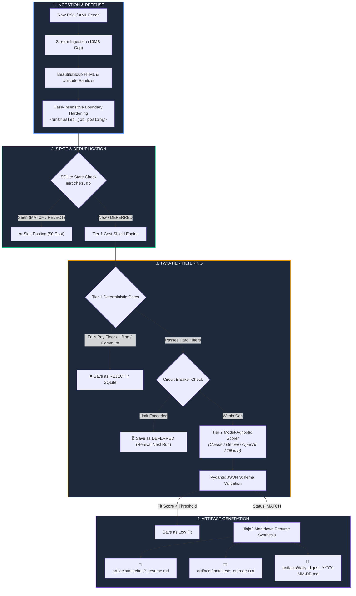

<div align="center">

```text
 ____                                      _     ___ 
| __ )  ___   __ _   ___  ___   _ __      / \   |_ _|
|  _ \ / _ \ / _` | / __|/ _ \ | '_ \    / _ \   | | 
| |_) |  __/| (_| || (__| (_) || | | |  / ___ \  | | 
|____/ \___| \__,_| \___|\___/ |_| |_| /_/   \_\|___|
```

### **Deterministic, Model-Agnostic Job Intelligence Engine**

*Bypass the algorithmic noise. Automate extraction. Eliminate search fatigue.*

---

[](https://www.python.org/)
[](LICENSE)
[](https://docs.pydantic.dev/)
[-6366F1?style=for-the-badge&logo=openai&logoColor=white)](https://docs.litellm.ai/)
[](tests/)

[Quick Start](#-quick-start) • [System Architecture](#-system-architecture) • [Security & Cost Shield](#-security--cost-shield) • [Why This Exists](#-the-human-origin-why-i-built-this) • [CLI Reference](#-cli-reference)

---

</div>

## 📌 Executive Overview

**BeaconAI** is an autonomous, model-agnostic CLI pipeline that flips the traditional hiring board paradigm. Instead of forcing job seekers into high-friction 20-hour/week manual sifting loops across algorithmic aggregators, BeaconAI ingests unstructured RSS/XML feeds, executes **zero-cost deterministic constraint gates** (Tier 1), scores cleared candidates with **structured LLM schemas across any provider** (Tier 2 via LiteLLM), and compiles bespoke Markdown application artifacts alongside a local daily digest.

```
       UNSTRUCTURED FEEDS               DETERMINISTIC GATES               GENERATED ARTIFACTS
 ┌─────────────────────────────┐    ┌─────────────────────────┐    ┌───────────────────────────────┐
 │ • Craigslist RSS            │    │ [Tier 1] Cost Shield    │    │ 📄 Tailored Markdown Resume   │
 │ • Municipal & County Boards │ ──>│ [Tier 2] Multi-LLM Scorer│ ──>│ ✉️  Draft Outreach / Mailto   │
 │ • Public Sector Feeds       │    │ SQLite Deduplication    │    │ 📊 Local Daily Markdown Digest│
 └─────────────────────────────┘    └─────────────────────────┘    └───────────────────────────────┘
```

---

## ⚡ The Human Origin: Why I Built This

Between 2024 and 2026, the tech job market reached peak algorithmic friction:
* **The Ghost Requisition Flood:** Up to 30%+ of online listings are ghost postings, drowning applicants in automated rejection emails and 5-round ATS loops.
* **The "Generalist Trap":** Commercial job boards force candidates to adapt to generic keyword algorithms, actively ignoring non-negotiable boundaries like localized commutes, strict compensation floors, predictable shift boundaries, and physical restrictions.
* **The Context Drift Problem:** Manually tuning interactive AI chats is fragile—chat threads reset, instructions drift, and proprietary models lock users into single ecosystems.

**BeaconAI** was engineered out of operational necessity: shifting job discovery from a draining, manual chore into a deterministic, version-controlled, and model-agnostic software process.

---

## 🔌 Zero Lock-In: Model-Agnostic LLM Layer

BeaconAI leverages **LiteLLM** and **Instructor** to normalize API schemas across all major foundation model providers and local runtimes. Switch between models instantly by changing a single `.env` variable with zero code modifications:

| Provider | Supported Engine Examples | Best Use Case |
| :--- | :--- | :--- |
| **Anthropic** | `claude-3-5-sonnet-20241022`, `claude-3-haiku` | Complex reasoning & deep resume bullet tailoring |
| **Google** | `gemini/gemini-2.5-flash`, `gemini/gemini-1.5-pro` | High-speed scoring & large batch processing |
| **OpenAI** | `gpt-4o`, `gpt-4o-mini` | Standard structured JSON evaluation |
| **Local / Offline** | `ollama/llama3.2`, `ollama/mistral`, `vllm` | 100% private, zero-token-cost local execution |

---

## 🏗 System Architecture

BeaconAI enforces a strict two-stage evaluation pipeline to guarantee zero wasted API tokens and complete prompt injection defense:



---

## 🛡 Security & Cost Shield

| Layer | Implementation | Security / Cost Defense |
| :--- | :--- | :--- |
| **Tier 1 Cost Shield** | Python Regex & String Tokens | Rejects unqualified roles **before** triggering LLM tokens ($0 API spend). |
| **Prompt Injection** | Delimiter Neutralization | Regex escaping for `</untrusted_job_posting>` + strict XML isolation. |
| **Circuit Breaker** | `MAX_LLM_EVALS_PER_RUN=20` | Prevents Denial of Wallet (DoW). Throttled jobs are saved as `DEFERRED` for future scans. |
| **Persistence Safety** | SQLite Parameterized Queries | 100% parameterized queries (`?`) with composite indexing on `(url, status)`. |
| **Human-in-the-Loop** | Local Artifact Synthesis | Pre-fills `mailto:` drafts and Markdown resumes; never auto-submits applications. |

---

## 🚀 Quick Start

### 1. Installation

```bash
# Clone repository
git clone https://github.com/ddgiovinazzo/beacon-ai.git
cd beacon-ai

# Initialize virtual environment, install dependencies, and setup DB
make init
```

*Manual Setup:*
```bash
python3 -m venv .venv
source .venv/bin/activate
pip install -r requirements.txt
python main.py init-db
```

### 2. Configure Environment (`.env`)

```bash
cp .env.example .env
```

```ini
# Model Selection (Supports any LiteLLM provider string)
# Examples: claude-3-5-sonnet-20241022, gemini/gemini-2.5-flash, gpt-4o-mini, ollama/llama3.2
LLM_MODEL=gemini/gemini-2.5-flash

# API Credentials (Set according to your chosen provider)
GEMINI_API_KEY=your_gemini_key_here
# ANTHROPIC_API_KEY=your_claude_key_here
# OPENAI_API_KEY=your_openai_key_here
# OLLAMA_API_BASE=http://localhost:11434

# Database path
DB_PATH=matches.db

# Circuit Breaker: Max LLM evaluations per single run
MAX_LLM_EVALS_PER_RUN=20

# Polite Crawler Identity
USER_AGENT=BeaconAI/1.0 (+https://github.com/beacon-ai; polite-job-crawler)
REQUEST_TIMEOUT_SECONDS=15
```

---

## 📋 Declarative Profile Configuration

BeaconAI completely decouples user preferences from execution logic. Customize your profile in `profiles/your_profile.json` (or copy one of the provided templates):

```bash
cp profiles/bookkeeper.json.example profiles/bookkeeper.json
```

```json
{
  "name": "Daniel Giovinazzo",
  "email": "contact@ddgiovinazzo.com",
  "phone": "555-019-2834",
  "location": "New York, NY",
  "linkedin_url": "https://linkedin.com/in/ddgiovinazzo",
  "constraints": {
    "min_hourly_rate": 20.0,
    "min_annual_salary": 45000.0,
    "max_commute_miles": 15,
    "physical_restrictions": [
      "heavy lifting > 25 lbs",
      "warehouse labor",
      "climb ladder"
    ],
    "schedule_boundaries": [
      "unannounced overtime",
      "graveyard shift"
    ]
  },
  "master_experience": {
    "target_titles": [
      "Software Engineer",
      "Systems Engineer",
      "Full Stack Developer"
    ],
    "roles": [
      {
        "title": "Software Engineer (K-12 Systems)",
        "organization": "PowerSchool",
        "location": "Remote / Folsom, CA",
        "start_date": "Jan 2021",
        "end_date": "Present",
        "bullets": [
          "Maintained modular data ingestion workflows for K-12 systems, protecting database integrity.",
          "Serialized legacy client web views into modern JSON payloads for 1,000,000 active users."
        ]
      }
    ],
    "tools_and_technologies": [
      "Python",
      "FastAPI",
      "SQLite",
      "Docker",
      "Git"
    ],
    "education": [
      "B.S. in Computer Science"
    ]
  }
}
```

---

## 💻 CLI Reference

### 1. Run Live Intelligence Scan
```bash
python main.py scan --profile profiles/bookkeeper.json.example --feed "https://hudsonvalley.craigslist.org/search/acc?format=rss"
```

### 2. Local Dry-Run (Test Fixtures)
Test ingestion and Tier 1 gates without calling external LLM APIs:
```bash
python main.py scan --profile profiles/bookkeeper.json.example --feed tests/fixtures/sample_jobs.xml --dry-run
```

### 3. Test Tier 1 Gate Rules (`test-eval`)
Instantly evaluate arbitrary job text against your profile constraints:
```bash
python main.py test-eval --text "Bookkeeper needed. \$22 - 26/hr. Seated office desk." --profile profiles/bookkeeper.json.example
```

### 4. Database Metrics & Match History (`stats`)
```bash
python main.py stats
```

---

## 🧪 Test Suite & QA Verification

BeaconAI includes 25 automated test fixtures verifying deterministic regex parsers, prompt injection boundaries, circuit-breaker states, and multi-provider LLM routing:

```bash
# Run complete test suite
pytest -v
```

```text
tests/test_evaluator.py::test_hourly_wage_extraction_ranges PASSED          [ 16%]
tests/test_evaluator.py::test_salary_to_hourly_conversion PASSED            [ 32%]
tests/test_evaluator.py::test_corporate_idiom_whitelisting PASSED          [ 48%]
tests/test_evaluator.py::test_circuit_breaker_deferred_status PASSED       [ 64%]
tests/test_evaluator.py::test_evaluate_tier2_llm_model_agnostic_routing PASSED [ 80%]
tests/test_ingestion.py::test_case_insensitive_tag_neutralization PASSED   [ 92%]
tests/test_ingestion.py::test_slug_uniqueness_for_identical_titles PASSED   [100%]

============================== 25 passed in 1.80s ==============================
```

---

## 📄 License

Distributed under the **MIT License**. See [`LICENSE`](LICENSE) for complete terms.